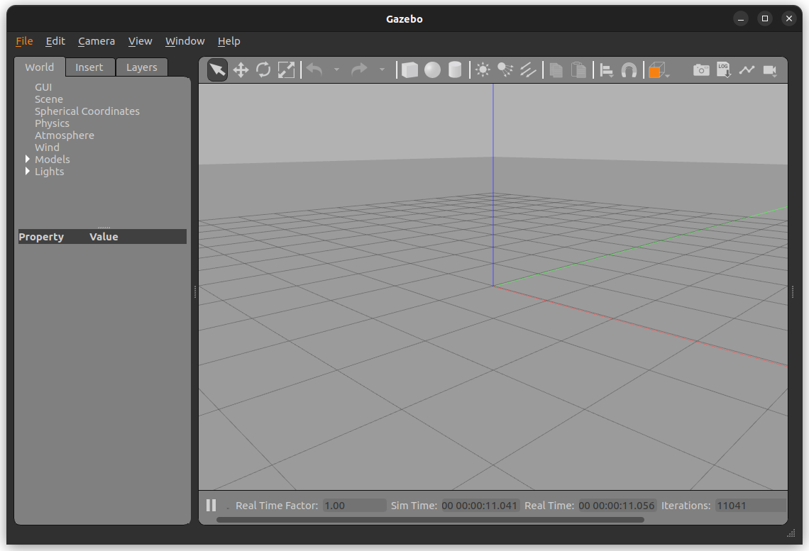
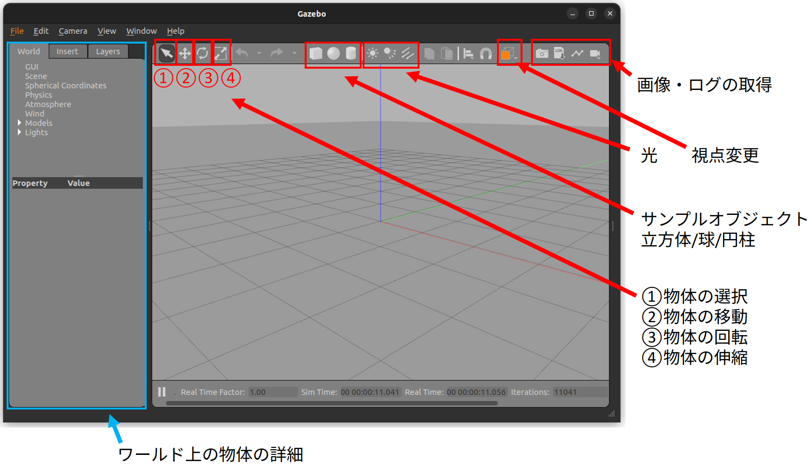
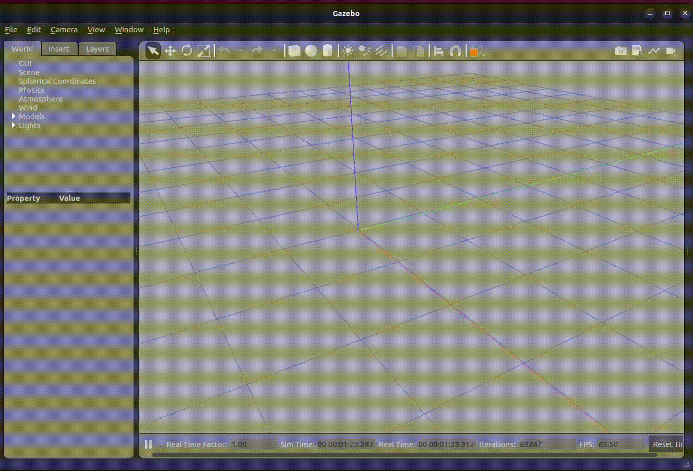
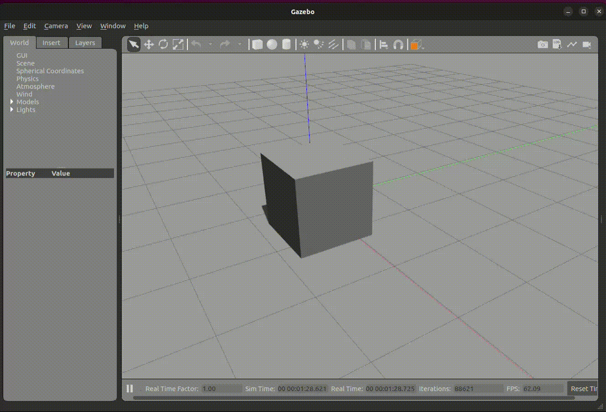
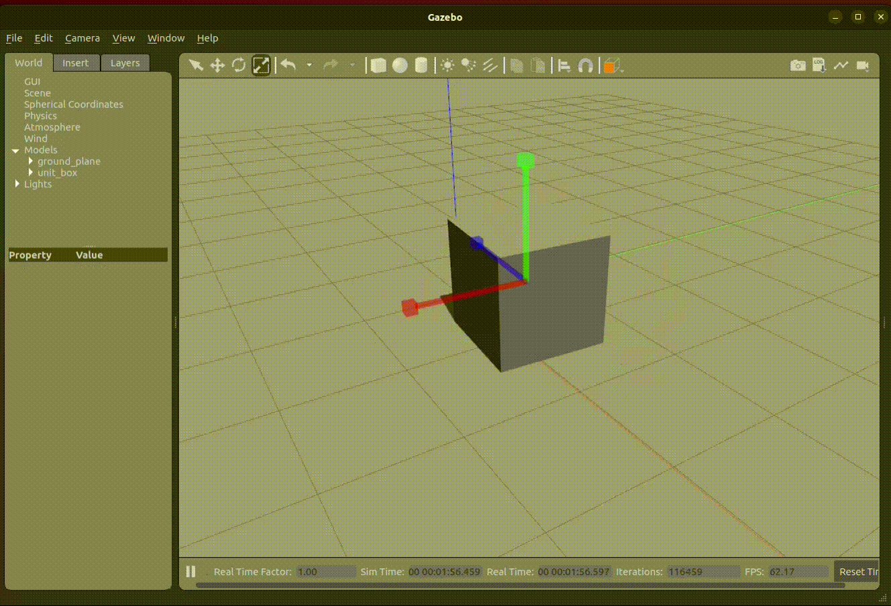
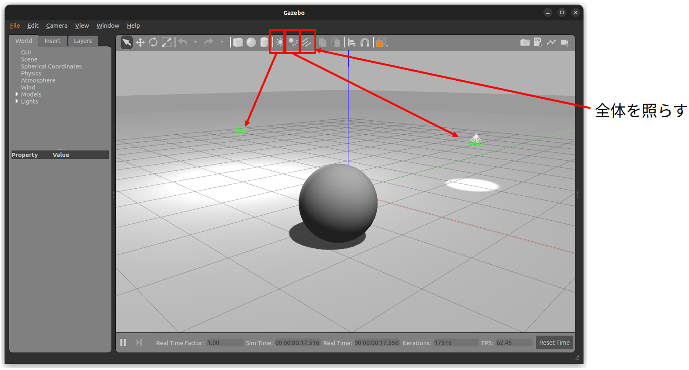

# Gazeboの使い方

Gazeboは、ROSに対応したシミュレータです。launchで実行することがほとんどですが、スタンドアロンでも実行可能です。




<br>

## インストール

```bash
sudo apt install gazebo
```

シンプルな起動は`gazebo`コマンドで実行できます。


<br>

## 各機能

Gazeboには多くのGUIツールが用意されています。



### 物体の選択

①ボタンを押すと物体を選択できます。ワールド上の物体の詳細などで値を確認・変更可能です。

後述の②〜④ボタンの動作の選択にも使えます。

<br>

### 物体の配置

サンプルオブジェクトを呼び出すことができます。物体のアイコンを選択後、任意の位置でクリックすることで物体を配置します。

物体には重力が働きます。



<br>

### 物体の移動

②ボタンを押したうえで物体を選択すると、x/y/z方向の矢印が出現します。その軸を持ってドラッグすることで物体を移動可能です。重力が働く物体は、以下の性質を持ちます。

- 地面を含む他物体と干渉した場合、上方向に飛び出す。
- 重力の影響を受けて自由落下運動を行う。



<br>

### 物体の回転

③ボタンを押した上で物体を選択すると、row/pitch/yaw方向の回転軸が出現します。その軸を持ってドラッグすることで物体を回転可能です。同様に重力の影響を受けます。


<br>

### 物体の伸縮

④を押した上で物体を選択すると、x/y/z方向の矢印が出現します。その軸を持ってドラッグすることで物体を伸縮可能です。



<br>

### 選択解除

①ボタンを押すとモード②〜④のモードを解除します。Escキーを押すと選択も解除されます。

<br>

### 光

光には3種類あります。

- 比較的広範囲の淡い光
- 狭い範囲の強い光
- 全体を強く照らす光


