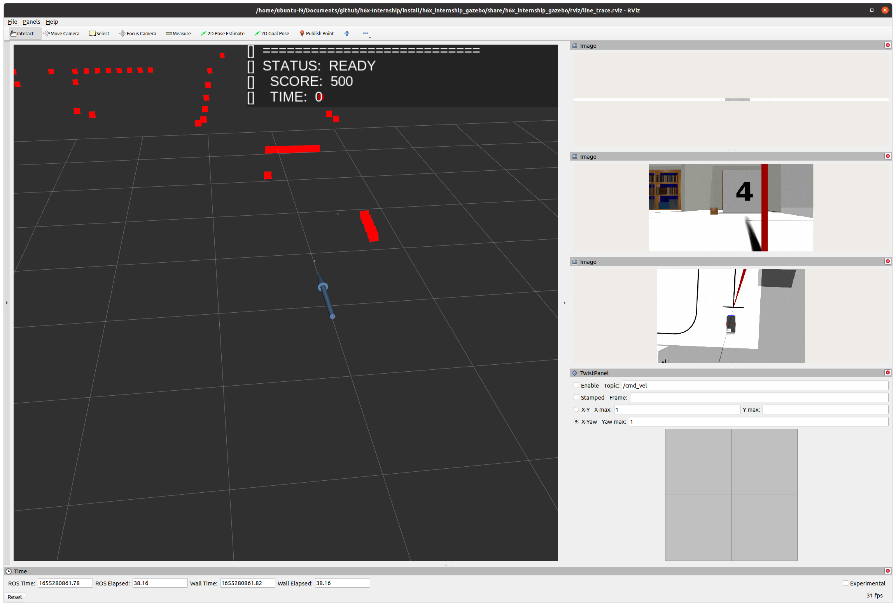
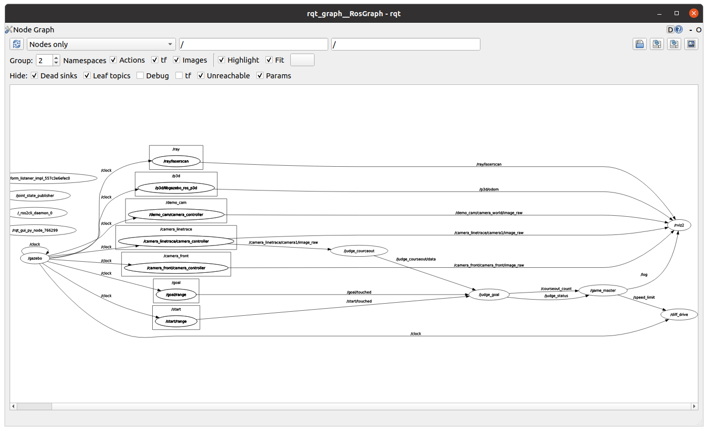
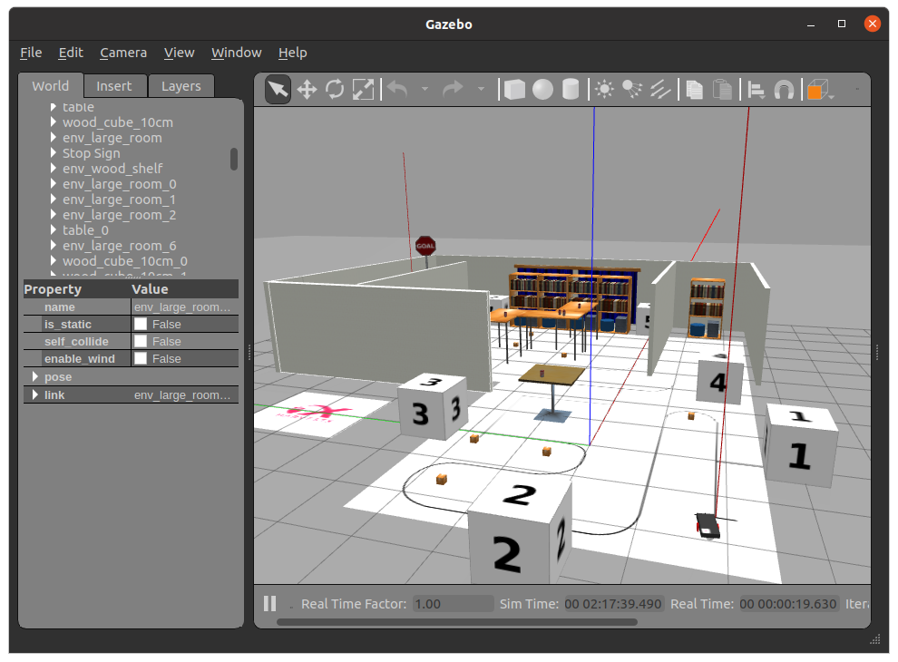

# 2. ROSとは（Rviz・Gazeboツールの解説込み）

ここでは、「ROS2」というツールがなぜ存在するのか、Gazeboとは何かについて解説します。

## 目次

## ROSとは

ROSとは、Robot Operating Systemの略です。WindowsやMacなどを指す「OS」も「Operating System」であるため、コンピュータのコアとなって動作するようにも聞こえますが、実際は、OS上で動く「ミドルウェア」の立ち位置です。

> ミドルウェアはアプリケーションとOSの中間に位置するソフトウェアであり、様々なアプリケーションと共有されます。ハードウェアとソフトウェアの差異を吸収したり、開発速度を向上させる目的で使用されます。
> 

ROSはロボット研究における長年の課題であった「車輪の再発明」を解決するためのツールとして開発され、10年以上経過した現在、世界中で使われるロボットの代表的なミドルウェアに成長しました。

ROSは、次のような機能があり、ロボット開発者に愛されています。

- ソフトウェアとソフトウェアをつなぐパイプ
    - 任意の通信名と形式を指定すれば他プロセス・他デバイス間の通信を簡単に実現します。多種多様な接続方法や環境で動作するソフトウェアを柔軟に非同期で通信させることはとても難しく、これを安定したプラットフォームが支える意義はとても大きいです。
- 豊富なツールも含めて全てオープンソース
    - RVizやGazebo、Moveltなどの有料ソフトであれば数十万もするような高機能ツールが全てオープンソースであり、ロボット開発に役立ちます。
    - ROS2の基幹システムはオープンソースです。
- 対応デバイスの豊富さ
    - Velodyneなどの数百万円するセンサからArduinoなどの小型デバイスまで、ROSは広く対応し、ハードウェアの差異を吸収するのに十分な開発環境を備えています。
    - 近年ではメーカー側が積極的にROS用ドライバをオープンソースで公開する流れも広まっており、コミュニティを活性化させています。
- コミュニティ
    - ROSプロジェクトやその関連パッケージへのオープンソースによる貢献は世界規模で行われています。自己位置推定や画像処理、

## ROSの基本的な機能・Pub-Sub通信

ROSはPublisher-Subscriber方式のプロセス間通信を非同期で行います。ROSを使用する理由のほとんどがこの機能の柔軟性に支えられれていると言っても過言ではありません。

### Pub-Sub通信

具体的には、プログラムA・B・Cが存在したとき、Aがタグ名”a”にデータを格納して送信、BとCが”a”というタグのデータを待つことにします。

このとき、プログラムAをPublisher（配信者）、BとCをSubscriber（購読者）と呼び、A・B・Cは互いの存在を知ることは無いですが、Aは配信を行い続け、BとCはそのタグのデータを受け取り次第、逐次処理を行って行きます。このような配信者と購読者が直接互いを認識しなくてもタグの識別によって通信を確立することができるシステムをそれぞれの名前を組み合わせて「Pub-Sub通信」と呼びます。

Subscriber側から見れば、データを受信するタイミングは不定期であるため、受信するプログラムはフリーズしないように非同期で呼び出されます。

Pub-Sub通信を身近な例で例えるとするなら、ラジオの選局が当てはまると思います。

ラジオの放送局（Publiisher）は特定周波数の電波（タグ）に音声（データ）を乗せて飛ばします。リスナー（Subscriber）は電波（タグ）を選択してその音声（データ）を受け取ることができます。

ROSによってPub-Subの入出力があるプログラムをノード（Node）と呼び、入出力をそれぞれトピック（Topic）と呼びます。各ROSパッケージやライブラリは、ノードの役割とその入出力のトピックを提示されており、開発者はそれを自在に組み合わせることで簡単にデバイスやアルゴリズムを流用することができます。

## ROS2

ROS2は、研究用途で開発されたROS1に産業的側面を考慮して設計されたROSです。

ROS2は、明確な使用がドキュメント化されており、設計の信頼性や継続的なメンテナンスが行われているミドルウェアであるDDSを採用しました。

> 戦艦やダム、金融、宇宙・航空システム、電車の線路切り替えなどの大規模なインフラでも採用される技術です。
> 

DDSには、ROSのPub-Sub通信に似たDDS-RPCという規格があり、この機能が従来のROSのPub-Subの機能を再現しました。

また、DDSは、信頼性のある転送を必要としないUDP通信上に信頼性を制御するQoSを実装しており、可搬性と信頼性の両立を実現しました。

## 各種ツール

ROSにはプログラム開発を支援する必要不可欠なツールを備えています。ここでは、ROS2に備わっているシステムについて説明します。

### RViz2（あーるゔぃず）

RVizは点群や座標、画像などを表示することができる3次元視覚化GUIツールです。必要に応じてプラグインを出し入れし、設定を保存することができる設計となっています。

「視覚化」が目的のため、主に、データ確認に使用されます。

### Rqt（あーるきゅーと）

Rqtは2次元の視覚化GUIツールです。こちらも必要に応じてプラグインを出し入れすることができますが、単一の機能も用意されています。

- rqt_graph：ROS上のノードとその接続を可視化します。プログラムが正しく接続されているかを確認する場合に使われます。

- rqt_bag：rosbagの記録・読み込みができます。
- rqt_image_view：画像トピックを読み込むことができます。(QoSによっては不可)
- rqt_topic：`ros2 topic list`と`ros2 topic echo`を同時に行う視覚化ツールです。

## Gazebo

Gazeboは、3D環境のオープンソースロボットシミュレータです。

複数の物理エンジンとROSのプラグインを使用可能なセンサ、ロボット向けの豊富なオブジェクトなどのプラグインが揃っています。

ROSではトピックの配信先を実機にするかシミュレータにするかを簡単に切り替えられるインフラを提供しているので，実機の数が限られている環境であったり，バグの再現が困難なActionの実装が求められる場面での開発を加速することができます．

## 参考資料（URL）

[The ROS Ecosystem](https://www.ros.org/blog/ecosystem/)

[ROS on DDS](http://design.ros2.org/articles/ros_on_dds.html)

 

[次へ](./part3.md)

[目次へ](./README.md)