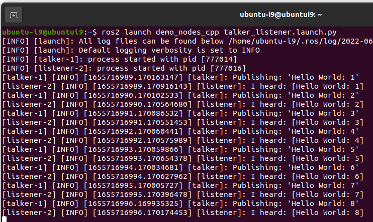
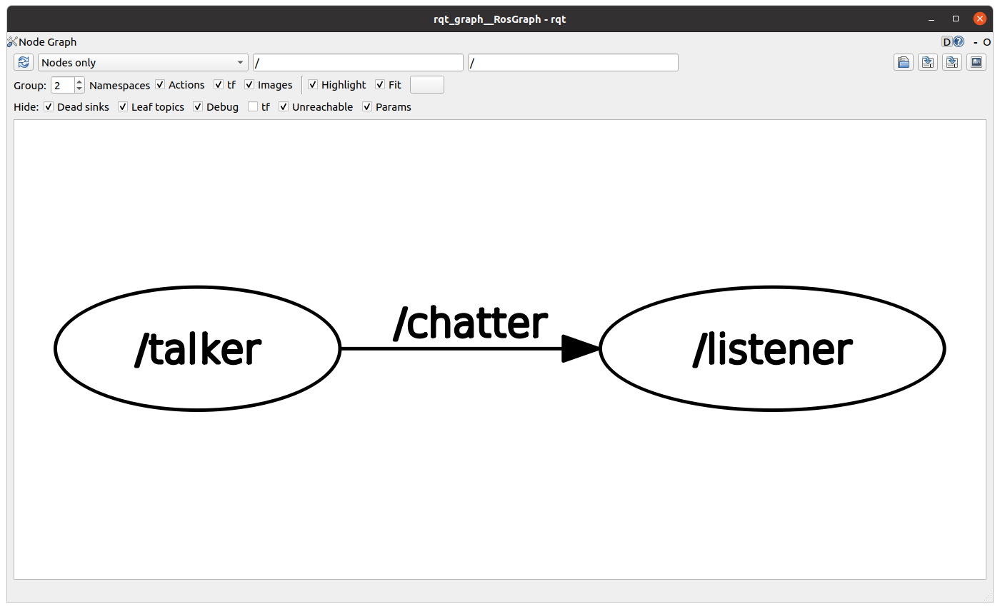
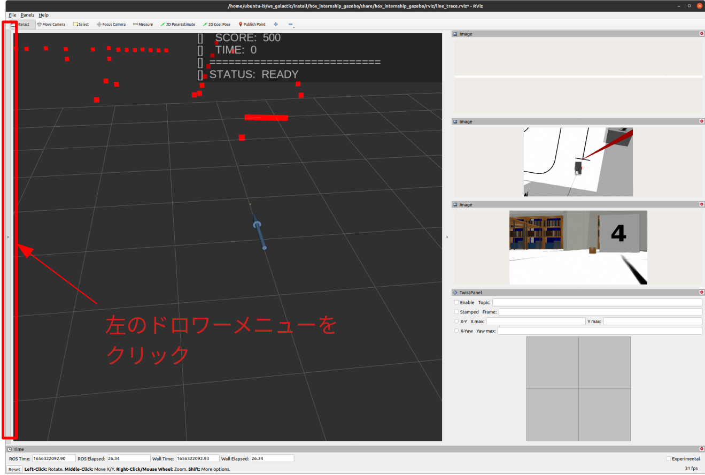
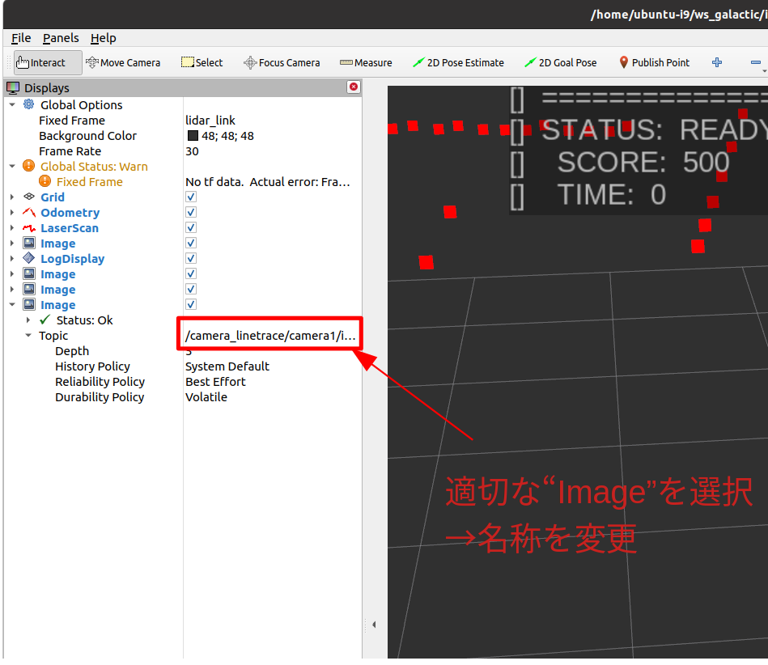
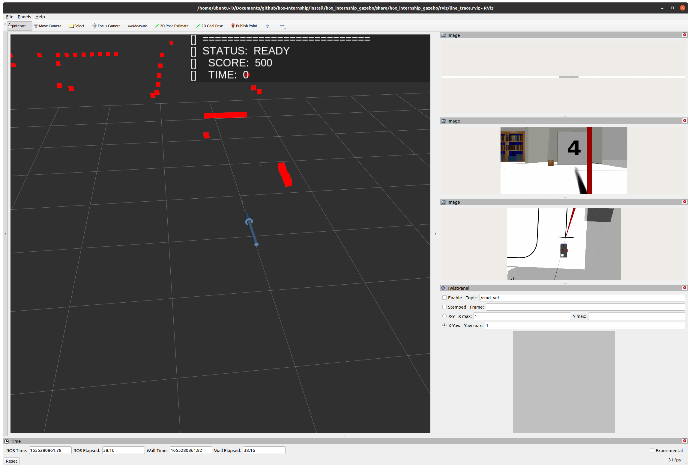

# 3. 環境構築とプログラムの動作確認

## 概要

ROS2のインストールと今回使用するシミュレーション環境の動作確認を行います。

## 環境

- Ubuntu20.04.4 LTS　(amd64)
- ROS2-Galactic Desktop

## ROS2-Galacticのインストール

以下のURL先のチュートリアルに従ってインストールします。

[Ubuntu (Debian) - ROS 2 Documentation: Galactic documentation](https://docs.ros.org/en/galactic/Installation/Ubuntu-Install-Debians.html)

Ubuntu20.04-Desktopがインストールされている状態から次のコマンドを入力します。

```bash
sudo apt install -y software-properties-common
sudo add-apt-repository universe

sudo apt update && sudo apt install -y curl gnupg lsb-release git
sudo curl -sSL https://raw.githubusercontent.com/ros/rosdistro/master/ros.key -o /usr/share/keyrings/ros-archive-keyring.gpg

echo "deb [arch=$(dpkg --print-architecture) signed-by=/usr/share/keyrings/ros-archive-keyring.gpg] http://packages.ros.org/ros2/ubuntu $(source /etc/os-release && echo $UBUNTU_CODENAME) main" | sudo tee /etc/apt/sources.list.d/ros2.list > /dev/null

sudo apt update
sudo apt install -y ros-galactic-desktop
```

動作確認をしてみます。このプログラムは、talkerとlistenerを同時に起動します。

```bash
source /opt/ros/galactic/setup.bash
ros2 launch demo_nodes_cpp talker_listener.launch.py
```



Pub-Subが通信成立していれば、「’Hello World: 数字’」がtalker、listenerからそれぞれ1回ずつ出力されます。

通信をしているかどうかが分からないときは、 `rqt_graph` を使います。rqt_graphは、ノード間の通信を可視化することができるGUIツールです。

```bash
source /opt/ros/galactic/setup.bash
rqt_graph
```

以下の画像では、talkerノードとlistenerノードが/chatterトピックで接続されていることが分かります。



## ビルドツールの導入

先ほどまでのインストールだけでは実行はできるものの、ビルドはできません。そのため、次のコマンドでインストールします。

以下のURLも合わせてご覧ください。

[Using colcon to build packages - ROS 2 Documentation: Galactic documentation](https://docs.ros.org/en/galactic/Tutorials/Colcon-Tutorial.html)

```bash
sudo apt install -y python3-colcon-common-extensions \
	python3-vcstool \
	python3-rosdep \
	python3-pip
```

# h6x-Internshipのビルド

[https://github.com/HarvestX/h6x-Internship](https://github.com/HarvestX/h6x-Internship)

h6x-internshipはライントレースと距離測定、画像処理可能なロボットを操作できるROS2対応Gazeboシミュレーション環境です。

```bash
mkdir -p ~/ws_galactic/src
source /opt/ros/galactic/setup.bash
cd ~/ws_galactic/src
git clone https://github.com/HarvestX/h6x-Internship.git


cd ../
bash src/h6x-Internship/setup.bash
colcon build --symlink-install
```

## 実行

```bash
source ~/ws_galactic/install/setup.bash
ros2 launch h6x_internship_gazebo world.launch.py
```

> 実行時に画像が乱れることがあります。
> 
- 画像が乱れたときの対策方法
    
    左のドロワーメニューからメニューを引き出し、トピック名を削除・変更します。
    
    
    
    トピック名などを弄ります。詳しくは、Rviz関連のチュートリアルサイトを確認してください。
    
    [Wiki](http://wiki.ros.org/rviz/UserGuide)
    
    
    




<br>

[前へ](./part2.md)

[次へ](./part4.md)

[目次へ](./README.md)
