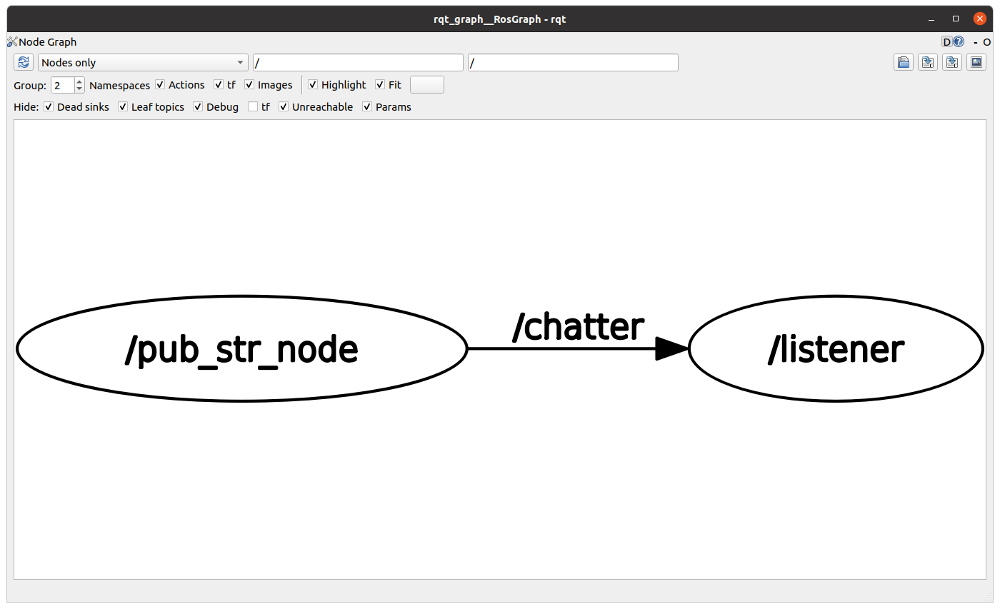
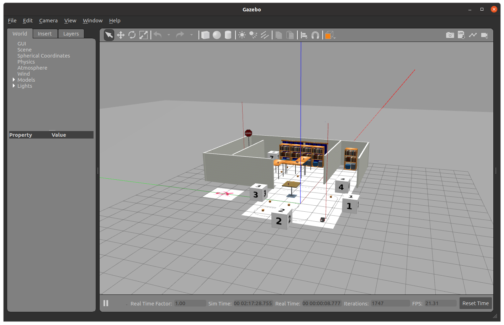
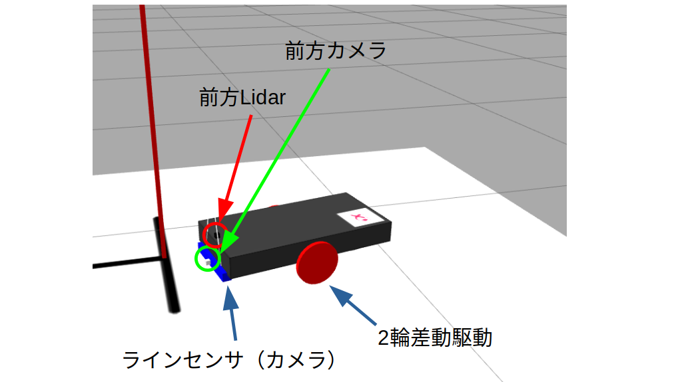
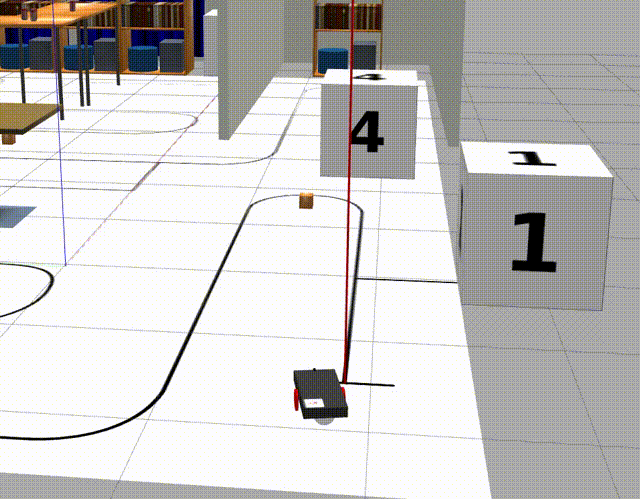
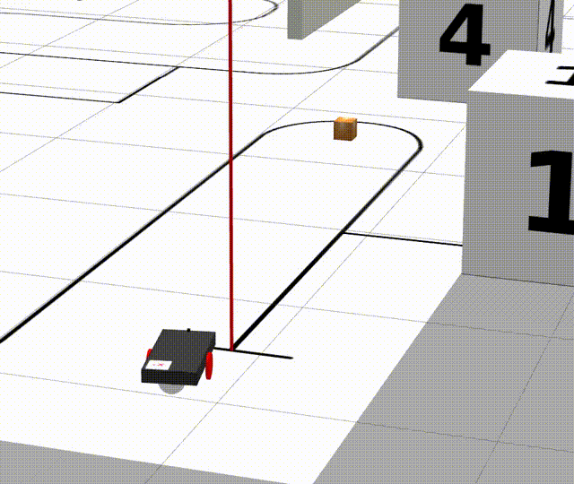

# 4. Pub（Twist送信・C++）→任意の方向に移動する

前節で解説した通り、ROSはPub-Subの通信をマルチキャスト通信を行います。ここでは、送信側について解説していきたいと思います。

## 目次

## 事前準備・環境読み込み

なお、この節以降のすべてのコマンドラインは、事前に次のコマンドを入力して環境変数を登録されていることを前提にしています。

```bash
source /opt/ros/galactic/setup.bash
```

- このコマンドで有効になった機能は、ターミナルを閉じるまで有効になります。
- 環境設定はターミナルごとにしか有効になりません。そのため、別の画面で別のバージョンのROS環境を読み込ませたりすることもできます。

毎度コマンドを入力するのが面倒な場合、ターミナル画面を開くときに実行される`~/.bashrc`ファイルにコマンドを入力するとよいでしょう。

```bash
echo "source /opt/ros/galactic/setup.bash" >> ~/.bashrc
# ターミナルを別の画面で開くと有効になります。
```

ROS2の環境が登録されているかが不明な場合、次のコマンドで環境が登録されているか確認できます。何も出力されていない場合、環境登録が失敗しているか、そもそも呼び出されていません。

```bash
echo $ROS_DISTRO
# 出力1 (環境登録 OK! )
# > galactic
# 出力2 (環境登録 MISS! ) 
# > (何も出力されない)
```

## ワークスペースの作成

`~/ws_galactic/src` にROS2用プログラムのプロジェクトを配置して、:  `~/ws_galactic` ディレクトリ上でビルドします。

> `CMakeLists.txt`と `package.xml`が入っているディレクトリよりも上の階層でビルドします。
> 

```bash
mkdir -p ~/ws_galactic/src
cd ~/ws_galactic/src
cd ../

colcon build --symlink-install
```

`colcon build` を使用すると、様々なパッケージを依存関係に従いつつビルドを行います。C++だけでなく、PythonのROS2パッケージもインストール可能です。

※今回の実行では、何のプロジェクトも入っていないため、ビルドされずに終了します。

`colcon build`によって生成されるフォルダは次の通りです。

- build : ビルド時のキャッシュ`--symlink-install` オプションなしの場合、消去可能
- install : バイナリや共有ファイルのインストール先
    - `--symlink-install` オプションを使用すると、PyファイルやLaunchファイルを再ビルドなしで書き換えられるようになります

# 文字列の送信（String）

まずは、最もシンプルなPublisherとして、文字列の送受信を試してみましょう。

### テンプレートによるプロジェクト生成

まずはテンプレートを生成します。

テンプレート生成は、 `ros2 pkg create` コマンドを使用します。

```bash
cd ~/ws_galactic/src
ros2 pkg create --build-type ament_cmake lecture
# 追加で空のc++、launch.pyファイルを作成
touch ~/ws_galactic/src/lecture/src/string_publisher.cpp
touch ~/ws_galactic/src/lecture/include/lecture/string_publisher.hpp
mkdir ~/ws_galactic/src/lecture/launch/
touch ~/ws_galactic/src/lecture/launch/string_publisher.launch.py
```

テンプレートの生成に成功したら、VSCodeを開きましょう。

```bash
code ~/ws_galactic/src/lecture/
```

フォルダ構造は以下の通りです。(treeコマンド使用)

```bash
lecture(dir)
|
├── CMakeLists.txt
├── include
│   └── lecture
│       └── string_publihser.hpp
├── launch
│   └── string_publihser.launch.py
├── package.xml
└── src
    └── string_publihser.cpp
```

ここでファイルの役割を説明します。

- `CMakeLists.txt` : C++のビルド設定を作成するための設定ファイル。（ament_cpp使用）
- `package.xml` : ROS2の依存関係の定義。
- `string_publisher.hpp` : `string_publisher.cpp`から呼び出されるヘッダーファイル
- `string_publisher.cpp` : 実行元のファイル
- `string_publisher.launch.py` : launchシステムの定義ファイル（Python形式）

まずは、launch以外のファイルを記述していきます。

## ソースコードの追加

### string_publisher.hpp

ROS2の基礎的な定義を記述します。コンストラクタ `StringPublisher` はコンストラクタ（クラスを実体化させるときに実行される）、メンバ関数 `publish_string`は1秒ごとに値を送信するメソッドです。

```bash
# ファイルのオープン
code ~/ws_galactic/src/lecture/include/lecture/string_publisher.hpp
```

### ファイル中の`::SharedPtr` とは？

- スマートポインタと呼ばれ、C++11以降の機能です。
- sharedptrとは、C++11以降の高度なメモリ確保・開放機能で、これまで `new` ・ `delete` などによって確保・開放されるメモリの開放忘れや重複定義を回避することができます。
- sharedptrの初期化は、基本、 `make_shared` を使用します。
    - ROS2では、内部でmake_sharedを使用して、その返り値（ポインタ）を返しています。
- `uniqueptr` という所有権を共有しないスマートポインタもあり、共有しない場合はこちらのほうがより安全です。
- メモリの開放忘れは、メモリリーク（使われていないのに使えないメモリ領域）という不具合を起こす原因になり、動作不能に陥る原因となります。

```cpp
#pragma once
#include <rclcpp/rclcpp.hpp>

// Include the header of the message type you want to publish.
#include <std_msgs/msg/string.hpp>

#include <chrono>

class StringPublisher: public rclcpp::Node
{
public:
    // Initialize this class.
    StringPublisher(const std::string name, const rclcpp::NodeOptions & options);

private:// Publish number function (method).
    void publishString();

    // Publisher definition.
    rclcpp::Publisher<std_msgs::msg::String>::SharedPtr pub_string_;
    // Timer definition.
    rclcpp::TimerBase::SharedPtr timer_;

    int64_t counter_;
};
```

### string_publisher.cpp

先程定義した `string_publisher.hpp` の中を記述します。実行時は、 `main` → `StringPublisher` の生成→ `publish_string` (1秒おき)の順で実行されます。

```bash
# ファイルのオープン
code ~/ws_galactic/src/lecture/src/string_publisher.cpp
```

```cpp
#include "lecture/string_publisher.hpp"

void StringPublisher::publishString()
{
    // Create a new message.
    std_msgs::msg::String _msg;

    // Set the message data. "msg" has "String data" field.
    // number to string
    _msg.data = std::to_string(this->counter_);
    // Publish the message.
    this->pub_string_->publish(_msg);

    // RCLCPP_INFO is print to console.
    std::string _log_msg = "Publish" + std::to_string(this->counter_);
    RCLCPP_INFO(this->get_logger(), "publish: %s", _log_msg.c_str());
    this->counter_++;
}

StringPublisher::StringPublisher(
	const std::string name,
	const rclcpp::NodeOptions &options) : Node(name, options)
{
    this->counter_ = 0;
    int64_t timer_ms = 1000;

    // Publisherの作成
    // - "std_msgs::msg::String"がメッセージの型
    // - QoSは今回は10とします。
    // - "chatter"は送信するトピック名です.
    this->pub_string_ = this->create_publisher<std_msgs::msg::String>("chatter", 10);

    // 1000ms (=1s)を定義します.
    std::chrono::milliseconds period(timer_ms);

    // "publish_string"を1秒おきに呼び出す定義.
    this->timer_ = this->create_wall_timer(period, std::bind(&StringPublisher::publishString, this));
}

// Entry point of this node.
int main(int argc, char **argv)
{
    // Initialize rclcpp (template).
    rclcpp::init(argc, argv);
    rclcpp::NodeOptions options;

    // Change point
    auto node = std::make_shared<StringPublisher>("pub_str_node", options);

    // spin and shutdown node (template).
    // This line will check timer callback or subscription callback
    rclcpp::spin(node);

    rclcpp::shutdown();

    return 0;
}
```

### package.xml

package.xmlには、初めてパッケージを見た人がどのような機能を持ち、パッケージに依存しているかなどを確認できるようにします。主に、テンプレートで生成された項目を埋めていきます。

なお、説明はREADMEに記述する場合が多いです。そのため、自分のプログラムを使い回す場合は、次の項目を書き換えることになります。

- nameタグ：パッケージ名
- descriptionタグ：パッケージの簡単な説明
- licenseタグ：（オープンソースの場合）ライセンスを記述
- dependタグ： `rclcpp` や `std_msgs` などのROSなどの依存ライブラリを記述。
    - 今回のように`ament_cmake_auto` を使用する場合、dependが不足するとパッケージを見つけられずにエラーが発生します。

```bash
# ファイルのオープン
code ~/ws_galactic/src/lecture/package.xml
```

```xml
<?xml version="1.0"?>
<?xml-model href="http://download.ros.org/schema/package_format3.xsd" schematypens="http://www.w3.org/2001/XMLSchema"?>
<package format="3">
  <name>lecture</name>
  <version>0.0.0</version>
  <description>TODO: Package description</description>
  <maintainer email="eg@example.com">ubuntu</maintainer>
  <license>TODO: License declaration</license>

  <buildtool_depend>ament_cmake_auto</buildtool_depend>

  <depend>rclcpp</depend>
  <depend>std_msgs</depend>

  <test_depend>ament_lint_auto</test_depend>
  <test_depend>ament_lint_common</test_depend>

  <export>
    <build_type>ament_cmake</build_type>
  </export>
</package>
```

### CMakeLists.txt

`CMakeLists.txt` は `Makefile` を生成するC/C++のビルド定義を記述するファイルで、本来は単体で動作しますが、ROS2の場合は、 `package.xml` と組み合わせて使用します。

- `project` タグは必ず定義され、 `package.xml` の `name` と同一である必要があります。

C++プログラムをコンパイルするときは次の通り記述していきます。

```bash
ament_auto_add_executable(実行名 コンパイル対象ファイル1　コンパイル対象ファイル2 ...)
```

以下にCMakeLists.txtを示します。

```bash
# ファイルのオープン
code ~/ws_galactic/src/lecture/CMakeLists.txt
```

```makefile
cmake_minimum_required(VERSION 3.8)
project(lecture)

if(CMAKE_COMPILER_IS_GNUCXX OR CMAKE_CXX_COMPILER_ID MATCHES "Clang")
  add_compile_options(-Wall -Wextra -Wpedantic)
endif()

find_package(ament_cmake_auto REQUIRED)
ament_auto_find_build_dependencies()

# pub-str Node ======================================================
set(TARGET string_publisher)
ament_auto_add_executable(${TARGET} src/${TARGET}.cpp)
# ===================================================================

if(BUILD_TESTING)
  find_package(ament_lint_auto REQUIRED)
  set(ament_cmake_copyright_FOUND TRUE)
  set(ament_cmake_cpplint_FOUND TRUE)
  ament_lint_auto_find_test_dependencies()
endif()

ament_auto_package(INSTALL_TO_SHARE launch)
```

## 実行

全てのファイルを保存したら、次のコマンドでビルドを行います。

```bash
cd ~/ws_galactic/
colcon build --symlink-install
# 以下はビルド中のログ
# Starting >>> lecture
# Finished <<< lecture [3.17s]

# Summary: 1 package finished [3.26s]
```

成功すると `Summary: 1 package finished [ビルド時間(s)]` と出ます。

実行は次の通りです。

```bash
source ~/ws_galactic/install/setup.bash
ros2 run lecture string_publisher

# 実行中のログ
# [INFO] [1655884506.449000155] [pub_str_node]: publish: Publish0
# [INFO] [1655884507.448933239] [pub_str_node]: publish: Publish1
# [INFO] [1655884508.448975584] [pub_str_node]: publish: Publish2
# [INFO] [1655884509.448757746] [pub_str_node]: publish: Publish3
# [INFO] [1655884510.448782166] [pub_str_node]: publish: Publish4
# [INFO] [1655884511.448790447] [pub_str_node]: publish: Publish5
# [INFO] [1655884512.448801912] [pub_str_node]: publish: Publish6
```

以上で、データの転送はできるようになりました。次に、これを受信しましょう。

別のターミナルを新しく開きます。

リスナについては、既存のリスナ `demo_nodes_cpp/listener` を使用します。

```bash
ros2 run demo_nodes_cpp listener

#実行中のログ
# [INFO] [1655884587.439947366] [listener]: I heard: [0]
# [INFO] [1655884588.439825353] [listener]: I heard: [1]
# [INFO] [1655884589.439553753] [listener]: I heard: [2]
# [INFO] [1655884590.439457573] [listener]: I heard: [3]
# [INFO] [1655884591.439576767] [listener]: I heard: [4]
# [INFO] [1655884592.439529570] [listener]: I heard: [5]
# [INFO] [1655884593.439763837] [listener]: I heard: [6]
```

これで、数字を文字列として送受信できました。

このとき、プログラムの接続は `pub_str_node`→`listener` となっています。

rqt_graphで確認しましょう　`/pub_str_node` から `listener` に `/chatter` という名前のトピックを送っています。



## Launchの作成

先程、プログラムの動作確認のためにターミナルを2つ起動しましたが、実際のロボット開発では、この比にならないプログラムが実行されることになります。そのたびにターミナルを開くのは非効率なので、複数プロセスの同時起動が必要になります。

launchファイルを使用することで、同時に複数のプロセスを立ち上げる他に、既存プログラムの内容を変更することなくパラメータを設定することができます。

詳しくは、以下のURL（Creating a launch file）を確認してみてください。

[Creating a launch file - ROS 2 Documentation: Galactic documentation](https://docs.ros.org/en/galactic/Tutorials/Intermediate/Launch/Creating-Launch-Files.html)

一つのノードを起動させる場合は、次の通りノードを定義することができます

```python
pub_str_node = Node(package='lecture', executable='string_publisher')
```

Nodeの中には次の項目を入れます。

- package : 実行するプログラムの `package.xml` のnameタグと同じ名前が入ります。
- executable : `CMakeLists.txt` (ament_cpp) や `[setup.py](http://setup.py)` (ament_python) で指定された実行名が入ります。

定義されたNodeを `launch.LaunchDescription` の引数に与えることで同時実行が可能です。

ノードは同じ中身でも実行時の名前が異なれば、別々のノードとして存在することが可能です。同一プログラムの別名の複数実行（カメラの前方後方など）が可能です。

```bash
# ファイルのオープン
code ~/ws_galactic/src/lecture/launch/string_publisher.launch.py
```

```python
import launch
from launch_ros.actions import Node

def generate_launch_description():
    pub_str_node = Node(package='lecture', executable='string_publisher')

    listener_node = Node(package='demo_nodes_cpp', executable='listener')

    return launch.LaunchDescription([
        pub_str_node,
        listener_node
    ])
```

実行はビルド後＆環境ロード後に

```python
ros2 launch lecture string_publisher.launch.py
```

で実行可能です。

<br>

# ロボットの直進・回転 (Twist)

先程のPublisherの基本プログラムを活用してロボットの直進・回転を行ってみましょう。

## launchファイルによるGazebo環境の呼び出し

まずは環境の準備を行います。

`lecture_world.launch.py` を作成し、内容を編集します。

```jsx
touch ~/ws_galactic/src/lecture/launch/lecture_world.launch.py
code ~/ws_galactic/src/lecture/launch/lecture_world.launch.py
```

内容を次に示します。このlaunchファイルでは、launchファイルからlaunchファイルを立ち上げています。 `IncludeLaunchDescription` で使用するlaunch (python) を宣言することができます。

- `gzserver.lauch.py` は、Gazeboワールドを立ち上げるプログラムです。描画は行わず、シミュレートのみが実行されます。
- `gzclient.launch.py` は、Gazeboワールドをレンダリングして表示するプログラムです。使用しない場合は描画されないだけでシミュレーションは通常通り動くため、リソースが厳しい場合に実行しないことをお勧めします。（gzclient_cmdをコメントアウトするだけです）

```python
import os

from launch_ros.actions import Node
from ament_index_python.packages import get_package_share_directory
from launch import LaunchDescription
from launch.actions import IncludeLaunchDescription
from launch.launch_description_sources import PythonLaunchDescriptionSource

def generate_launch_description():
    pkg_gazebo_ros = get_package_share_directory('gazebo_ros')

    world = os.path.join(
        get_package_share_directory('h6x_internship_gazebo'),
        'worlds',
        'env_line_room.world'
    )

	# gzserver.lauch.py
    gzserver_cmd = IncludeLaunchDescription(
        PythonLaunchDescriptionSource(
            os.path.join(pkg_gazebo_ros, 'launch', 'gzserver.launch.py')
        ),
        launch_arguments={'world': world, 'verbose': 'true'}.items()
    )
	# gzclient.launch.py
    gzclient_cmd = IncludeLaunchDescription(
        PythonLaunchDescriptionSource(
            os.path.join(pkg_gazebo_ros, 'launch', 'gzclient.launch.py')
        )
    )

    return LaunchDescription([
        gzserver_cmd,
        gzclient_cmd,
    ])
```

これを実行すると、次のような画面が出現します。



## シミュレーション用ロボットについて

シミュレーションのロボットは次のデバイスで構成されています。

- 2輪差動駆動
    - Twistデータ（/cmd_vel）を受信します。
- ラインセンサ
    - 1x100のImageデータ（`/camera_linetrace/camera1/image_raw`）を送信します。
- 前方Lidar
    - -30°〜30°の範囲で50点のLaserScanデータ（`/ray/laserscan`）を送信します。
    - 距離範囲
        - 最小：0.05m (5cm)
        - 最長：30m
- 前方カメラ
    - 640x360のImageデータ（`/camera_front/camera_front/image_raw`）を送信します。



ここでは、2輪差動駆動に対してTwistデータを送信することでロボットを前進させてみます。

まず、ロボットを操縦するメッセージである `Twist` について説明します。

## Twistデータについて

実世界上の移動方向は（ロボットに限らず）直進移動・回転移動で分け、それぞれx・y・z (回転方向ならroll・pitch・yaw) で指定します。

ROS2では移動・回転速度の指定にTwistメッセージを使用します。

Twistメッセージは、geometry_msgsパッケージの中にあります。

[common_interfaces/Twist.msg at rolling · ros2/common_interfaces](https://github.com/ros2/common_interfaces/blob/rolling/geometry_msgs/msg/Twist.msg)

Twistメッセージは次のデータを持っています。

- linear (geometry_msgs/vector3型)
    - x (float64型)
    - y (float64型)
    - z (float64型)
- angular (geometry_msgs/vector3型)
    - x  (float64型)
    - y  (float64型)
    - z  (float64型)


直進方向のyのデータに変数を代入する場合は、 `_msg.linear.y = 1.0;` とします。

```cpp
geometry_msgs::msg::Twist _msg;
_msg.linear.y = 1.0;
```

> 実際に実装する際は、どの軸がどの方向になっているかを確認する必要があり、それがずれている場合もあります。（例：RealSense T265のodomやUnityの座標軸など）
>

次は、C++からTwistメッセージの送信プログラムを作っていきます。

## ソースコードの追加

### ビルド設定

package.xmlの14行目付近に追加

`geometry_msgs` はポイントやベクトル、ポーズ（自己位置）などの一般的なジオメトリプリミティブのメッセージを提供するものです。

そのメッセージ内のTwistはロボットの移動方向を指定する用途によく使われます。

```xml
<depend>geometry_msgs</depend>
```

CMakeLists.txtの15行目付近に追加

```makefile
set(TARGET twist_publisher)
ament_auto_add_executable(${TARGET} src/${TARGET}.cpp)
```

### ソースコード

C++ファイル

⚠️`string_publisher.hpp`と同じディレクトリに`twist_publisher.hpp`を置きます。

```cpp
#pragma once
#include <rclcpp/rclcpp.hpp>

// Include the header of the message type you want to publish.
#include <geometry_msgs/msg/twist.hpp>

#include <chrono>

class TwistPublisher: public rclcpp::Node
{
public:
    // Initialize this class.
    TwistPublisher(const std::string name, const rclcpp::NodeOptions & options);

private:// Publish number function (method).
    void publishTwist();
    void subscribeLaser();

    // Publisher definition.
    rclcpp::Publisher<geometry_msgs::msg::Twist>::SharedPtr pub_twist_;
    // Timer definition.
    rclcpp::TimerBase::SharedPtr timer_;
};
```

⚠️`string_publisher.cpp`と同じディレクトリに`twist_publisher.cpp`を置きます。

一定周期ごと（1秒ごと）に呼び出されるpublish_twist関数がTwistのメッセージを送信しています。

```cpp
#include "lecture/twist_publisher.hpp"

void TwistPublisher::publishTwist()
{
    // Create a new message.
    geometry_msgs::msg::Twist _msg;

    // Set the message data. "msg" has "Twist data" field.
    // number to Twist
    _msg.linear.x = 1.0;
    _msg.angular.z = 0.0;
    // Publish the message.
    this->pub_twist_->publish(_msg);
}

TwistPublisher::TwistPublisher(
	const std::string name,
	const rclcpp::NodeOptions &options) : Node(name, options)
{
    int64_t timer_ms = 1000;

    // Create a publisher.
    // - "geometry_msgs::msg::Twist" is the message type.
    // - 10 is qos (Don't change).
    // - "cmd_vel" is the name of publisher.
    this->pub_twist_ =
			this->create_publisher<geometry_msgs::msg::Twist>("cmd_vel", 10);

    // Create a timer definition. Interval is 1 second (= 1000ms).
    std::chrono::milliseconds period(timer_ms);

    // Create a timer. Call "publish_twist" method when timer is triggered.
    this->timer_ =
			this->create_wall_timer(period, std::bind(&TwistPublisher::publishTwist, this));
}

// Entry point of this node.
int main(int argc, char **argv)
{
    // Initialize rclcpp (template).
    rclcpp::init(argc, argv);
    rclcpp::NodeOptions options;

    // Change point
    auto node = std::make_shared<TwistPublisher>("pub_twist_node", options);

    // spin and shutdown node (template).
    rclcpp::spin(node);
    rclcpp::shutdown();

    return 0;
}
```

### ビルド

ビルドは次のコマンドで行います。

```bash
cd ~/ws_galactic/
colcon build --symlink-install
```

### 実行

実行してみましょう (別のターミナルで ``lecture_world.launch.py` を実行)

```bash
source ~/ws_galactic/install/setup.bash
ros2 run lecture twist_publisher
```



次は、車両を回転させてみましょう。 `_msg.angular.z = 1.0;` を追記しましょう。

```cpp
void TwistPublisher::publishTwist()
{
    // Create a new message.
    geometry_msgs::msg::Twist _msg;

    // Set the message data. "msg" has "Twist data" field.
    // number to Twist
    _msg.linear.x = 1.0;
    _msg.angular.z = 1.0;
    // Publish the message.
    this->pub_twist_->publish(_msg);
}
```

再ビルドしましょう。



当然ながら値をマイナスにすれば、逆に移動します。

## 📝課題

- ブロック4に到達するようにパラメータを調整しましょう。


<br>

[前へ](./part3.md)

[次へ](./part5.md)

[目次へ](./README.md)