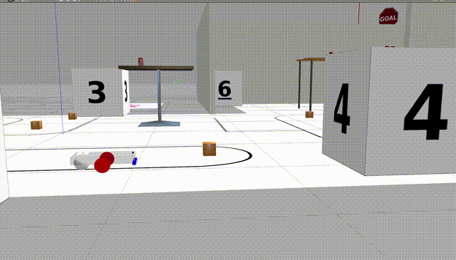

# 5. Sub（Range受信・C++）→4番の箱で停止

前節では、直進・回転動作を行いましたが、ここでは、距離に応じて挙動を変化させてみましょう。

ここでは距離センサを用いて物体の距離を取得します。



### package.xml

15行目に追記

```xml
<depend>sensor_msgs</depend>
```

### CMakeLists.txt

18行目に追記

```makefile
set(TARGET laser_subscriber)
ament_auto_add_executable(${TARGET} src/${TARGET}.cpp)
```

### laser_subscriber.hpp

```cpp
#include <rclcpp/rclcpp.hpp>

// Include the header of the message type you want to publish.
#include <geometry_msgs/msg/twist.hpp>
#include <sensor_msgs/msg/laser_scan.hpp>

#include <chrono>

class LaserSubscriber: public rclcpp::Node
{
    public:
        // Initialize this class.
        LaserSubscriber(
					const std::string name, const rclcpp::NodeOptions & options);

    private:// Publish number function (method).
        void publishTwist();
        void onLaser(const sensor_msgs::msg::LaserScan::SharedPtr msg);

        // Publisher definition.
        rclcpp::Publisher<geometry_msgs::msg::Twist>::SharedPtr pub_twist_;
        rclcpp::Subscription<sensor_msgs::msg::LaserScan>::SharedPtr sub_laser_;
        // Timer definition.
        rclcpp::TimerBase::SharedPtr timer_;

        float range_;
	};
```

### laser_subscriber.cpp

**QoS**

ROS2は通信品質を保証するためにQoSを設定します。QoSを設定するということは、余分なデータを送信して結果を確認するため、QoSは送信側と受信側が同じ（あるいは互換性がある）必要があります。

- Reliability (信頼性)

ネットワーク上では、データは常に欠損リスクを伴います。そのため、通常はデータの欠損が無いかどうかの照合作業を行います。「電話で通話したときに、雑音で聞き取れなかったりした場合にその場所のみを聞き返す」ような感じです。

しかし、データ送受信に置いて「聞き返す」作業がリアルタイム性を損なう可能性があり、これは、ハードウェアが伴うロボットのソフトウェアでは不適切な場合があります。そのため、DDSのQoSでは次の2通りの信頼性を設定できるようになります。

- Best Effort：「できる限り努力する」＝最善は尽くすが保証はしない
    - メリット：成功の可否にかかわらず1回しか送信しないためリアルタイムでデータの転送が可能
    - デメリット：ネットワークが不安定だとデータの欠損があるため、トリガの送信には不向き、フィルタなどの処理が前提になる
    - 用途：常に同じフォーマットのデータ、IMU・距離センサなどの高周期なセンサ、デッドラインがハードウェア寄りなシステム
- Reliable：データの確実な転送を保証
    - メリット：ネットワークによる**受け取った**データの欠損リスクがない
    - デメリット：欠損があると再送する場合があるため、いつまでも送受信が成立しない可能性がある。

Gazeboはセンサデータを Best effortで送信します。qosの設定を以下に示します。

`rclcpp::keepLast(1)` は受信するキャッシュを1に設定します。この設定により、subscriberは未受け取りな最新のデータを1つしか保持しません。

```cpp
auto qos = rclcpp::QoS(rclcpp::KeepLast(1)).best_effort();
```

`laser_subscriber.cpp`を作成します。

```cpp
#include "lecture/laser_subscriber.hpp"

void LaserSubscriber::publishTwist()
{
    // Create a new message.
    geometry_msgs::msg::Twist _msg;

    // Set the message data. "msg" has "Twist data" field.
    // number to Twist
    _msg.linear.x = 0.1;
    _msg.angular.z = -0.0;
    // show range
    std::cout << "range: " << range << std::endl;
    if (range < 0.5)
    {
        _msg.linear.x = -0.1;
        _msg.angular.z = 0.0;
    }
    else if (range > 0.6)
    {
        _msg.linear.x = 0.1;
        _msg.angular.z = 0.0;
    }
    else
    {
        _msg.linear.x = 0.0;
        _msg.angular.z = 0.0;
    }
    // Publish the message.
    pub_twist_->publish(_msg);
}

void LaserSubscriber::onLaser(const sensor_msgs::msg::LaserScan::SharedPtr msg)
{
    // data length
    int length = msg->ranges.size();
    // data range
    this->range_ = msg->ranges[int(length/2)];
}

LaserSubscriber::LaserSubscriber(
	const std::string name,
	const rclcpp::NodeOptions &options) : Node(name, options)
{
    int64_t timer_ms = 10;
    this->range_ = 0.0;

    // Create a publisher.
    // - "geometry_msgs::msg::Twist" is the message type.
    // - "cmd_vel" is the name of publisher.
    this->pub_twist_ =
			this->create_publisher<geometry_msgs::msg::Twist>("cmd_vel", 10);

    // Create a timer definition. Interval is 1 second (= 1000ms).
    std::chrono::milliseconds period(timer_ms);

    // Create a timer. Call "publish_twist" method when timer is triggered.
    this->timer_ =
			this->create_wall_timer(period, std::bind(&pub_twist::publishTwist, this));

    // best effort, keep last
    auto qos = rclcpp::QoS(rclcpp::KeepLast(1)).best_effort();
    this->sub_laser_ =
			this->create_subscription<sensor_msgs::msg::LaserScan>(
				"ray/laserscan",
				qos,
				std::bind(&LaserSubscriber::onLaser, this, std::placeholders::_1));
}
// Entry point of this node.
int main(int argc, char **argv)
{
    // Initialize rclcpp (template).
    rclcpp::init(argc, argv);
    rclcpp::NodeOptions options;

    // Change point
    auto node = std::make_shared<LaserSubscriber>("sub_laser_node", options);

    // spin and shutdown node (template).
    rclcpp::spin(node);
    rclcpp::shutdown();

    return 0;
}
```

### lecture_laser_twist.launch.pyの作成

```python
import os

from launch_ros.actions import Node
from ament_index_python.packages import get_package_share_directory
from launch import LaunchDescription
from launch.actions import IncludeLaunchDescription
from launch.launch_description_sources import PythonLaunchDescriptionSource

def generate_launch_description():
    pkg_gazebo_ros = get_package_share_directory('gazebo_ros')

    world = os.path.join(
        get_package_share_directory('h6x_internship_gazebo'),
        'worlds',
        'env_line_room.world'
    )

    gzserver_cmd = IncludeLaunchDescription(
        PythonLaunchDescriptionSource(
            os.path.join(pkg_gazebo_ros, 'launch', 'gzserver.launch.py')
        ),
        launch_arguments={'world': world, "verbose": "true"}.items()
    )

    gzclient_cmd = IncludeLaunchDescription(
        PythonLaunchDescriptionSource(
            os.path.join(pkg_gazebo_ros, 'launch', 'gzclient.launch.py')
        )
    )

    sub_laser = Node(
        package='lecture',
        executable='laser_subscriber',
    )

    return LaunchDescription([
        gzserver_cmd,
        gzclient_cmd,
        sub_laser
    ])
```

## 実行

```bash
cd ~/ws_galactic/
colcon build --symlink-install

source ~/ws_galactic/install/setup.bash
ros2 launch lecture lecture_laser_twist.launch.py
```

## 課題

## 参考資料（URL）

[RELIABILITY QosPolicy](https://community.rti.com/static/documentation/connext-dds/5.2.0/doc/manuals/connext_dds/html_files/RTI_ConnextDDS_CoreLibraries_UsersManual/Content/UsersManual/RELIABILITY_QosPolicy.htm)

<br>

[前へ](./part4.md)

[次へ](./part6.md)

[目次へ](./README.md)