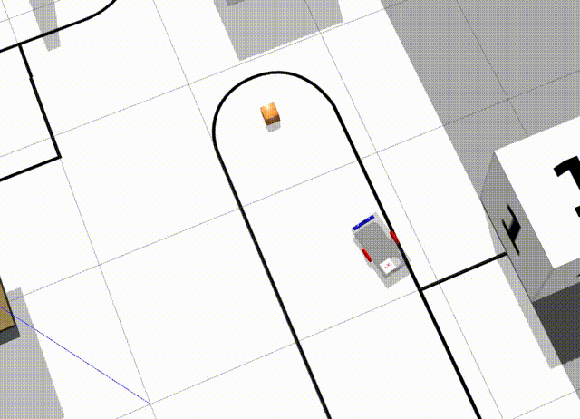
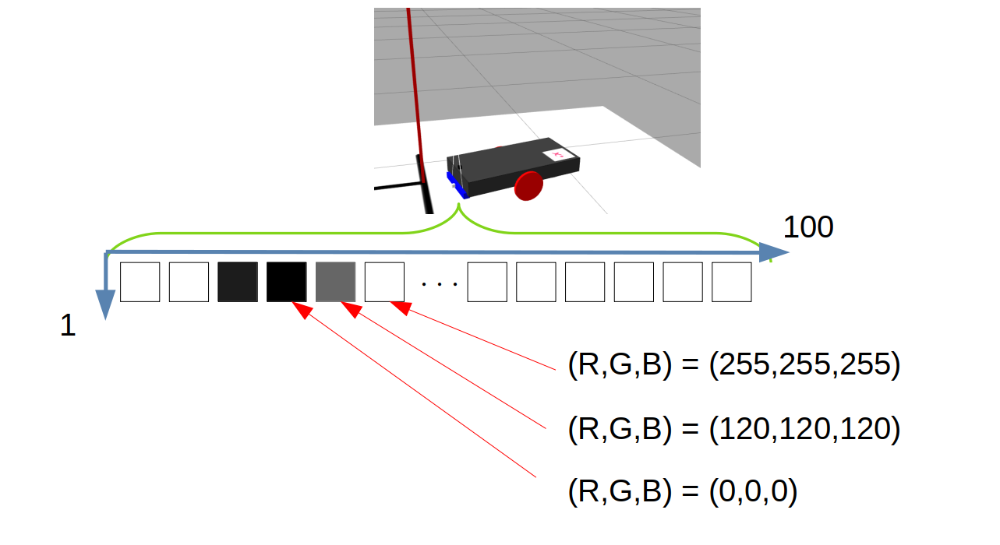
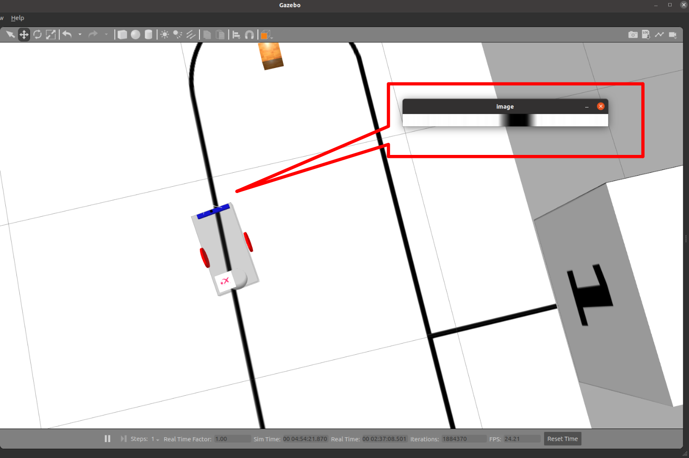
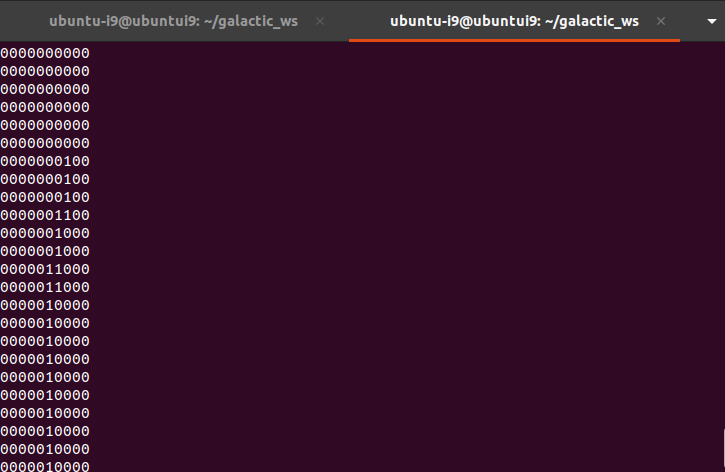
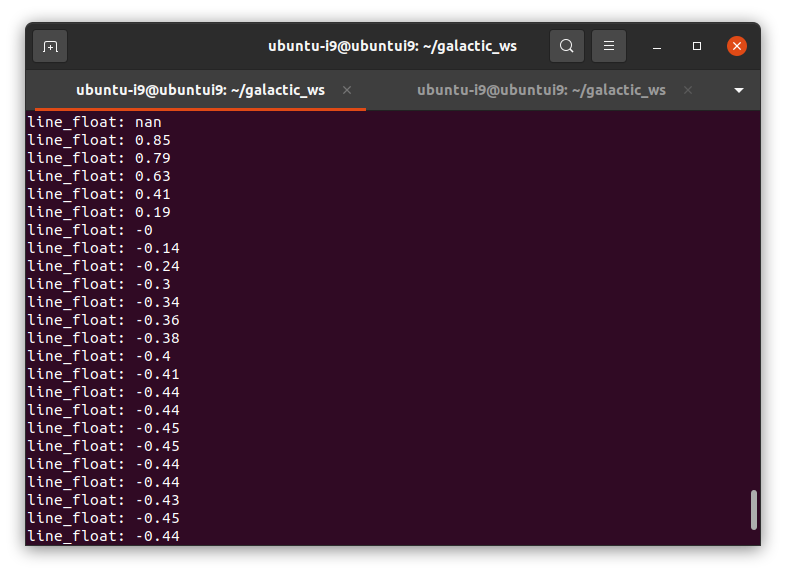

# 6. ライントレース（画像処理）

次は、画像処理を使用してデータの取得を行いましょう。

最終的に以下のgifのようなライントレースを実現します。



## 画像処理

画像処理とは、カメラなどの撮像素子から転送された2・3次元配列で構成データをもとに解析を行う作業です。

Gazebo上のライントレースでは、赤外線を飛ばして反射光を見る代わりに画像を取得してその値をセンサ値とします。取得する画像は縦1横100のデータとなっています。



## 画像取得

まずはImageトピックから画像を取得して表示させてみます。

### image_view.cpp

`src` に新規作成します。

```cpp
#include "lecture/image_view.hpp"

ImageView::ImageView(const std::string name, const rclcpp::NodeOptions &options) : Node(name, options)
{
    // best effort, keep last
    auto qos = rclcpp::QoS(rclcpp::KeepLast(1)).best_effort();
	// 受信側の設定
    this->sub_image_=
		this->create_subscription<sensor_msgs::msg::Image>(
			"camera_linetrace/camera1/image_raw",
			qos,
			std::bind(&ImageView::onImage, this, std::placeholders::_1));
}

void ImageView::onImage(const sensor_msgs::msg::Image::SharedPtr msg)
{
    // Convert the message to OpenCV format.
    auto bridge_cpy = cv_bridge::toCvCopy(msg, "bgr8");

	// 画像の表示（分かりやすいように拡大）
    cv::resize(bridge_cpy->image, bridge_cpy->image, cv::Size(), 5, 30);
    cv::imshow("image", bridge_cpy->image);
    cv::waitKey(1);
}

int main(int argc, char *argv[])
{
    rclcpp::init(argc, argv);
    auto node = std::make_shared<ImageView>("sub_image", rclcpp::NodeOptions());
    rclcpp::spin(node);
    rclcpp::shutdown();
    return 0;
}
```

`subscribe_image` では、画像を取得して何かしらの処理を行っています。

`auto bridge_cpy = cv_bridge::toCvCopy(msg, "bgr8");` は、msgをcv_bridge::CvImagePtr型に変換指定ます。この型の `bridge_cpy->image` 要素にOpenCVによる画像処理が可能なデータが格納されています。

### image_view.hpp

`include/lecture` に新規作成

```cpp
#pragma once
#include <rclcpp/rclcpp.hpp>

#include <sensor_msgs/msg/image.hpp>
#include <cv_bridge/cv_bridge.h>

#include <opencv2/opencv.hpp>

class ImageView: public rclcpp::Node
{
public:
    // Initialize this class.
    ImageView(const std::string name, const rclcpp::NodeOptions & options);

private:// Publish number function (method).
    void onImage(const sensor_msgs::msg::Image::SharedPtr msg);

    rclcpp::Subscription<sensor_msgs::msg::Image>::SharedPtr sub_image_;
};
```

### package.xml

追記

```xml
<depend>OpenCV</depend>
<depend>cv_bridge</depend>
```

### CMakeLists.txt

追記

```makefile
set(TARGET image_view)
ament_auto_add_executable(${TARGET} src/${TARGET}.cpp)
```

## ビルド

```bash
cd ~/ws_galactic/
colcon build --symlink-install

source ~/ws_galactic/install/setup.bash
ros2 run lecture image_view
```



ラインセンサから画像を取得することができました。画像だけでわかりにくい場合は、ターミナルに直接データを出力してもいいでしょう。100個のデータをループで取得し、10回に1回出力すれば、ターミナル出力だけでデータを取得できます。

画像を受け取ってターミナルに `0000100000` という感じで受け取るプログラムを以下に示します。

（cv_bridgeで `bridge_cpy->image` に変換後）

```cpp
		cv::Mat gray_image = cv::Mat::zeros(bridge_cpy->image.size(), CV_8UC1);
		cv::cvtColor(bridge_cpy->image, gray_image, cv::COLOR_BGR2GRAY);

    std::string line_info = "";

		// 10回ループ
    for (size_t i = 0; i < gray_image.size().width; i += 10)
    {
        if (gray_image.at<uchar>(0,i) < 50)
        {
            line_info += "1";
        }
        else
        {
            line_info += "0";
        }
    }
    std::cout << line_info << std::endl;
```

表示例 (1がラインを示している)



## 📝課題

- データ `0000100000` のように線の中心だと0、 `1000000000` のように線の左側だと-1.0、逆だと1.0のように変換してターミナルに出力してみましょう。

↓実行例



- Twistデータに変換して、 `/cmd_vel` で送信してみましょう。

<br>

[前へ](./part5.md)

[次へ](./score.md)

[目次へ](./README.md)
