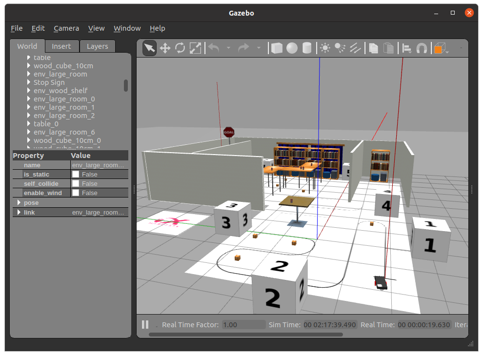

# フィールド・スコアについて

## 目次

## シミュレーション用ロボットについて

シミュレーションのロボットは次のデバイスで構成されています。

- 2輪差動駆動
    - Twistデータ（/cmd_vel）を受信します。
    - デフォルトではx, yawともに1.0〜-1.0が速度の上限です。
- ラインセンサ
    - 1x100のImageデータ（/camera_linetrace/camera1/image_raw）を送信します。
    - コースアウト判定にも使われるセンサです。
- 前方Lidar
    - -30°〜30°の範囲で50点のLaserScanデータ（/ray/laserscan）を送信します。
    - 距離範囲
        - 最小：0.05m (5cm)
        - 最長：30m
    - スタート・ゴール以外の物体には当たり判定があるため、各物体の距離測定が可能です。
- 自己位置推定
    - `/p3d/odom` を使用します。
    - コマンド＞ `ros2 topic echo /p3d/odom`

- 前方カメラ
    - 640x360のImageデータ（/camera_front/camera_front/image_raw）を送信します。


## フィールドについて




フィールド上に赤い棒が2本立っています。手前側がスタート、GOAL看板の方がゴールとなっており、スタート→ゴールの順で通るとスコアが表示されます。

- スコアは開始時点から減点方式となっています。
- 1秒に1点減点されます。
- ラインから外れると1秒におよそ10点減点されます。
- 残り0点になるかゴールに到達するとcmd_velの操作が効かなくなります。
- ゴールすると、スコアに応じて評価が付きます。（スコア/最大スコアx100）
    - 80% : S
    - 70% : A+
    - 60% : A
    - 50% : B+
    - 40% : B
    - 30% : C+
    - 20% : C
    - 10% : D+
    - 0%以上 : D

## ビルド（Galactic）

```bash
mkdir -p ~/ws_galactic/src
source /opt/ros/galactic/setup.bash
cd ~/ws_galactic/src
git clone https://github.com/HarvestX/h6x-Internship.git

# ビルド
cd ../
bash src/h6x-Internship/setup.bash
colcon build --symlink-install
```

## ワールドの実行

```bash
source ~/ws_galactic/install/setup.bash
ros2 launch h6x_internship_gazebo world.launch.py
```

## 追加予定（未定）

- 時間追加
- 速度上限追加


<br>

[目次へ](./README.md)
